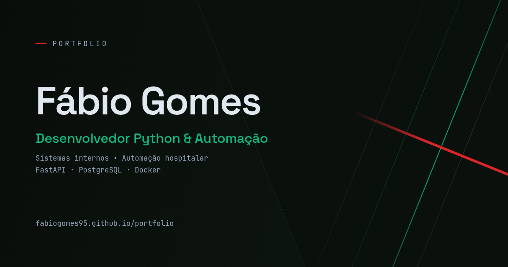

# Portfólio — Fábio Gomes

Site pessoal onde reúno meus projetos de automação, sistemas internos e desenvolvimento web.
Disponível em português e inglês.

**Ao vivo:** https://fabiogomes95.github.io/portfolio
**In English:** https://fabiogomes95.github.io/portfolio/en



---

## Sobre

Sou desenvolvedor Python com foco em automação operacional e sistemas internos.
Trabalho na Prefeitura Municipal de Extremoz/RN, onde mantenho em produção um
sistema de automação hospitalar — recepção digital, painel gerencial e
faturamento BPA/SUS.

Este site reúne os projetos que tirei do papel, os que estão em produção e os
pessoais ainda em desenvolvimento.

## Stack

HTML5, CSS3 e JavaScript puro. **Sem frameworks, sem bibliotecas, sem build.**

A escolha foi proposital: o site é estático e leve o bastante para não precisar
de nada disso, e manter zero dependências significa que ele não quebra com
atualização de terceiro nem carrega script de outro domínio.

| | |
|---|---|
| Layout | CSS Grid e Flexbox, responsivo sem media query nas grades (`auto-fit` + `minmax`) |
| Interatividade | `IntersectionObserver` para o menu ativo e a revelação ao rolar |
| Formulário | Formspree via `fetch`, com aprimoramento progressivo |
| Hospedagem | GitHub Pages |
| Idiomas | Duas páginas HTML reais (pt-BR e en) ligadas por `hreflang`, em vez de troca de textos por JavaScript — assim cada idioma é indexado separadamente pelo Google |

## Estrutura

```
.
├── index.html                  # página em português (é a raiz do site)
├── en/
│   └── index.html              # página em inglês — mesmo conteúdo, traduzido
├── style.css                   # estilos, em 15 seções comentadas — serve às duas
├── script.js                   # menu ativo, revelação ao rolar, formulário — idem
├── og-banner-1200x630.png      # imagem do card ao compartilhar o link
├── curriculo-fabio-gomes.pdf   # currículo em português (usado pela raiz)
├── cv-fabio-gomes.pdf          # CV em inglês (usado pela /en/)
└── README.md
```

Tudo na raiz de propósito: o GitHub Pages serve a partir dela, então `index.html`,
`style.css` e `script.js` precisam estar ali. Criar `css/` e `js/` para três
arquivos só acrescentaria caminho sem ganho nenhum.

O CSS e o JavaScript são **um só para os dois idiomas**. O script lê o
`<html lang>` para decidir em que língua responder no formulário, e localiza o
cabeçalho por classe em vez de id, já que o id muda entre as versões.

## Decisões que valem nota

**Aprimoramento progressivo no formulário.** O `<form>` tem `action` e `method`
no HTML, então envia normalmente sem JavaScript. O script apenas intercepta o
envio para mostrar o retorno na própria página. Se o JS falhar, o formulário
continua funcionando.

**A classe que esconde os elementos é aplicada pelo JavaScript, nunca escrita
no HTML.** Se ela estivesse na marcação e o script não carregasse, o site
abriria em branco. Do jeito atual, sem JS tudo simplesmente aparece.

**Acessibilidade.** Link para pular a navegação, foco visível pelo teclado
(`:focus-visible`), rótulos associados aos campos do formulário e respeito a
`prefers-reduced-motion` — quem configurou o sistema para reduzir animações não
recebe nenhuma.

**Animo apenas `opacity` e `transform`,** que a GPU resolve sem forçar o
navegador a recalcular o layout a cada quadro.

## Rodando localmente

Como não há build, basta servir a pasta. O formulário de contato precisa de um
servidor HTTP — pelo `file://` a requisição é bloqueada por CORS.

```bash
git clone https://github.com/fabiogomes95/portfolio.git
cd portfolio
python3 -m http.server 8000
```

Depois abra http://localhost:8000

## Contato

[LinkedIn](https://www.linkedin.com/in/fabiogsilva95/) ·
[GitHub](https://github.com/fabiogomes95) ·
fabiogsilva@disroot.org
